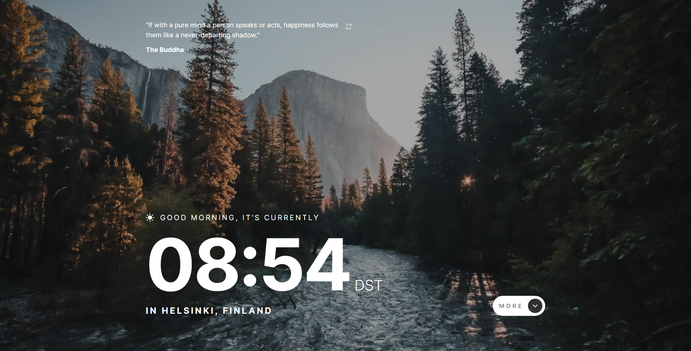

# Clock app

This is a solution to the [Clock app challenge on Frontend Mentor](https://www.frontendmentor.io/challenges/clock-app-LMFaxFwrM).

## Table of contents

  - [The challenge](#the-challenge)
  - [Screenshot](#screenshot)
  - [Links](#links)
  - [Built with](#built-with)
  - [Author](#author)

### The challenge

Users should be able to:

- View the optimal layout for the site depending on their device's screen size
- See hover states for all interactive elements on the page
- View the current time and location information based on their IP address
- View additional information about the date and time in the expanded state
- Be shown the correct greeting and background image based on the time of day they're visiting the site
- Generate random programming quotes by clicking the refresh icon near the quote

### Screenshot

### Links

- [Live Site](https://hromus-51.github.io/clock-app/)

### Built with

- [TS](https://www.typescriptlang.org/)
- [Styled Components](https://styled-components.com/)
- [React](https://reactjs.org/) 
- [Redux Toolkit](https://redux-toolkit.js.org/)
- [Framer Motion](https://www.framer.com/motion/)

## Author

- Telegram - [Ilgiz Farrakhov](https://t.me/Gizmo51)
